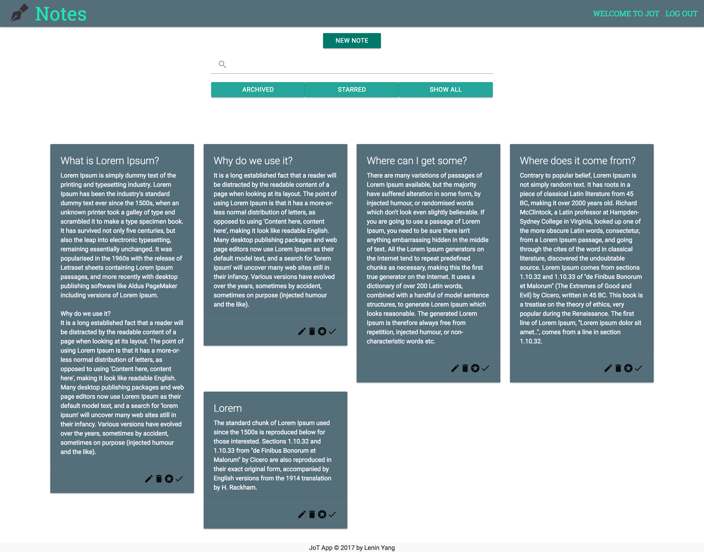

# JoT

_**/jät/ verb:** to jot means to write (something) quickly. JoT is a simple note taking application that helps capture what's on your mind._

## Technologies

**FRONTEND:**
- AngularJS, Node.js, Express.js, HTML, CSS

**CSS FRAMEWORK**
- [Materialize](http://materializecss.com/)

**AUTHENTIFICATION**
- Javascript Web Tokens

## User Stories
**User should be able to:**

- Create an account.
- Create, update, delete a note.
- See a list of all the notes.
- Search through his/her notes.
- Star/Favorite a note
- See a list of all the starred/favorited notes.
- Archive a note
- See a list of all archived notes.

**Stretch:**

- Ability to add photos in your notes
- Ability to format notes (i.e. bold, italic, bullet list)
- Share notes with other users (Collaboration)
